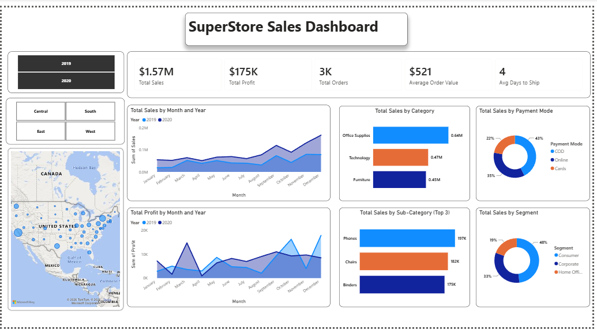

# SuperStore Sales Dashboard

## Project Overview

An interactive Power BI dashboard analyzing SuperStore sales, profit, orders, customer segments, categories, and regional performance.

## Key Analysis

- Analyzed sales and profit performance across different months and years.
- Examined sales distribution across product categories and sub-categories.
- Analyzed regional sales performance using interactive maps.
- Compared customer segments and payment modes to understand sales patterns.
- Used interactive filters to explore sales performance across different dimensions.

## Tools Used

- Power BI
- DAX
- Calculated Columns
- Measures
- Data Visualization
- KPI Cards
- Trend Analysis
- Interactive Filters
- Map Visualization

## Dashboard Features

- KPI cards for Total Sales, Total Profit, Total Orders, Average Order Value, and Average Days to Ship.
- Monthly sales and profit trend analysis.
- Category and sub-category sales analysis.
- Regional sales performance analysis.
- Payment mode and customer segment analysis.
- Dynamic filtering by year, region, and other dimensions.

## Dashboard Preview

